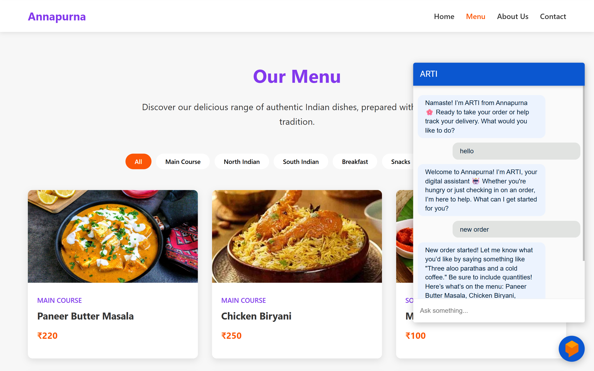

# 🤖 Arti – AI-Powered Chatbot

_Your smart assistant built with Dialogflow and integrated into the web_

---

📸 **Live Demo Screenshot**  


---

## 📖 About the Project

**Arti** is an AI-powered chatbot developed as part of the **Edunet–Microsoft Foundation Artificial Intelligence Internship**, officially recognized by **AICTE**. This project showcases the use of **Dialogflow** to create an intelligent conversational agent that can answer user queries and be integrated into websites with ease.

This project allowed me to apply what I learned in machine learning, NLP, and generative AI to a practical, real-world use case.

---

## 🎯 Features

- Understands user intent through NLP
- Extracts entities like course names or user preferences
- Contextual responses based on input
- Web-based chat interface (HTML, CSS, JS)
- Customizable responses and fallback handling

---

## 🛠️ Tech Stack

- **Dialogflow CX / ES**
- **JavaScript, HTML, CSS**
- **Webhook Integration (Optional: Python/Node.js)**
- **Google Cloud Platform**

---

## 📦 Installation

1. Clone the repository:
   ```bash
   git clone https://github.com/swayamDev/food-delivery-chatbot.git
   cd food-delivery-chatbot
   ```
